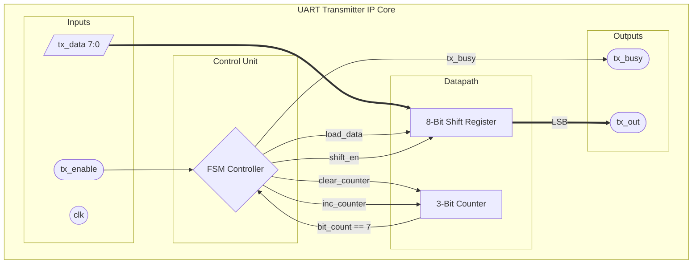
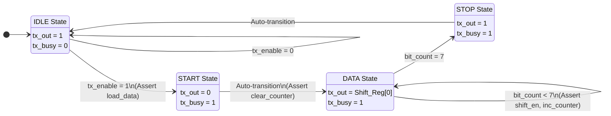

UART Transmitter (8-N-1) IP Core

📌 Project Overview

This repository contains the complete RTL design, verification, and synthesis of a parameterized UART Transmitter IP Core.

As my first formal VLSI project, I focused heavily on adhering to a professional hardware engineering lifecycle—moving strictly from protocol specification to micro-architecture, and finally to RTL implementation and Static Timing Analysis (STA).

⚙️ The Engineering Process

1. Specification & Requirements

The goal was to design an asynchronous serial transmitter adhering to the standard UART 8-N-1 protocol:

Idle State: Line held HIGH.

Start Bit: 1 clock cycle LOW to wake the receiver.

Data Payload: 8 bits transmitted sequentially, Least Significant Bit (LSB) first.

Stop Bit: 1 clock cycle HIGH to conclude the frame.

2. Architecture & Datapath Separation

To ensure clean synthesis and prevent timing violations, the architecture strictly separates the Control Unit (FSM) from the Datapath (Registers/Counters). The FSM acts as the "brain," sending control signals to the "muscle."

3. Micro-Architecture (Finite State Machine)

The Control Unit is implemented as a 4-state Moore/Mealy hybrid machine. Below is the exact signal flow and state transition graph used to code the Next-State logic:

📊 Verification (Testbench)

The RTL was verified using a self-checking testbench in Xilinx Vivado.

Test Scenario: Transmitting the hex payload 8'hA5 (Binary: 10100101).
As shown in the waveform below, the FSM successfully pulls the line LOW for the START bit, shifts the alternating bits (1-0-1-0-0-1-0-1) LSB-first, and pulls the line HIGH for the STOP bit.

📈 Synthesis & Implementation Results

The design was synthesized in Xilinx Vivado. The explicit Datapath-Control separation resulted in a highly optimized, lightweight logic footprint with zero latches.

Resource Utilization

LUTs: 15 (0.01%)

Registers (Flip-Flops): 15 (0.01%)

Total On-Chip Power: 0.376 W (Dynamic: 0.244 W)

Timing Analysis

Because the datapath relies entirely on direct register shifts and a minimal 3-bit counter, the combinational delay ($T_{comb}$) is negligible. With standard XDC constraints, this core is capable of closing timing at $>100$ MHz.

Designed by Govindraj R | Built for VLSI/Embedded Hardware Portfolio
